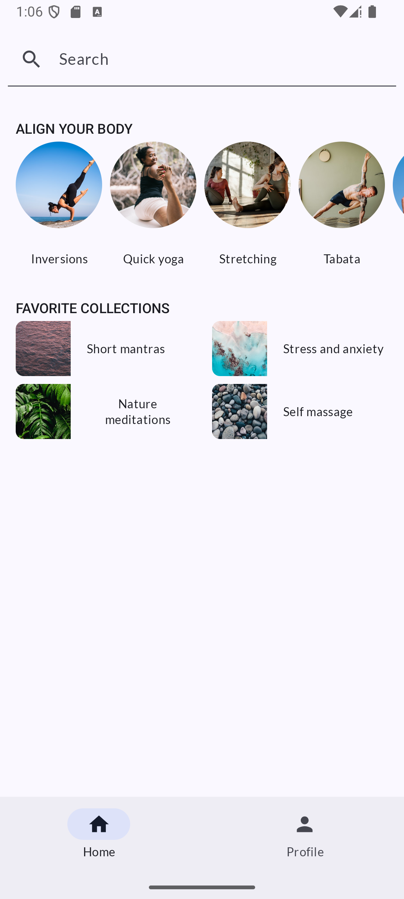

# 🚀 My Android App

[](https://github.com/prasadaraoteela/learn-jetpack-compose/actions/workflows/android_build.yml)
[](https://github.com/prasadaraoteela/learn-jetpack-compose/actions/workflows/github-code-scanning/codeql)


[](LICENSE)


An Android app built with **Jetpack Compose**, **Kotlin**, and **MVVM**, featuring automated checks using **GitHub Actions**.

---

## 🧰 Features

- Jetpack Compose UI
- MVVM Architecture
- Hilt for Dependency Injection
- Detekt for static code analysis
- Ktlint or Spotless for formatting
- GitHub Actions for CI/CD

---

## 📸 Screenshots

| Home Screen |
|-------------|
|  |

---

## 🛠 Tech Stack

- **Kotlin**
- **Jetpack Compose**
- **AndroidX**
- **Hilt**
- **Retrofit**
- **Room**
- **GitHub Actions** for CI
- **Detekt** for linting
- **Gradle Kotlin DSL**

---

## ✅ GitHub Actions

This project uses GitHub Actions for automated checks:

### ➤ `android_build.yml`
Runs on every push/pull request:
- Lint check
- Unit tests
- Assemble debug build
- Detekt check

---

## 🧪 Running Locally

```bash

# Clone the repo
git clone https://github.com/prasadaraoteela/learn-jetpack-compose.git

# Navigate to project
cd learn-jetpack-compose

# Android Clean Build
./gradlew clean assembleDebug

```

## 🧹 Static Code Analysis

```bash
# Run Detekt
./gradlew detekt

# Run Format Check (if using ktlint or spotless)
./gradlew ktlintCheck

```
